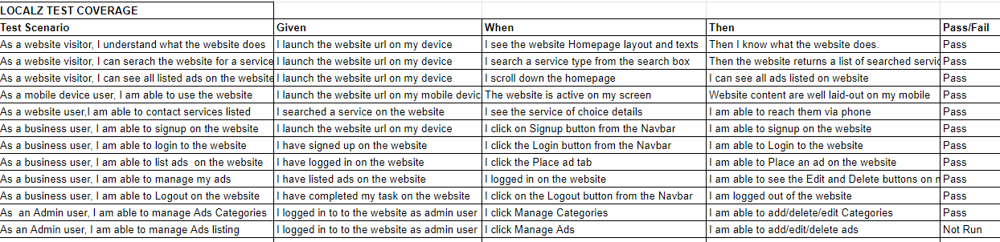

## Table of Contents
* [Purpose](#Purpose)
* [User Experience Design (UX)](#User-Experience-Design)
  * [User stories](#User-Stories)
    * [First Time Visitor Goals](#First-Time-Visitor-Goals)
    * [Returning Visitor Goals](#Returning-Visitor-Goals)
    * [Frequent User Goals](#Frequent-User-Goals)
  * [Structure](#Structure)
  * [Design](#Design)
    * [Colour Scheme](#Colour-Scheme)
    * [Typography](#Typography)
    * [Imagery](#Imagery)
    * [Wireframes](#Wireframes)
    * [Differences to Design](Differences-to-Design)
* [Limitations](#Limitations)
- [Features](#Features)
    * [Existing Features](#Existing-Features)
    * [Future Features](#Features-Left-to-Implement)
* [Technologies](#Technologies)
* [Testing](#Testing)
    * [Test Strategy](#Test-Strategy)
      * [Summary](#Summary)
      * [High Level Test Cases](#High-Level-Test-Cases)
      * [Out of Scope](#Out-of-Scope)
    * [Test Results](#Test-Results)
    * [Testing Issues](#Issues-and-Resolutions-to-issues-found-during-testing)
* [Deployment](#Deployment)
    * [Project Creation](#Project-Creation)
    * [Project Deployment](#Using-Heroku)
    * [Locally](Run-Locally)
* [Credits](#Credits)
  * [Content](#Content)
  * [Media](#Media)
  * [Acknowledgements](#Acknowledgements)
  * [Comments](#Comments)

# Milestone Project 3
## Purpose
This Website was created for the sole purpose of completing the third Milestone Project for the Code Institute's Full Stack Developer course. 
It was built using the knowledge gained from the HTML, CSS, Javascript, Python+Flask and Backend Development with the Flask framework modules.
A full list of technologies used can be found in the technologies section of this document.

The live website can be found [here](https://localz-fm.herokuapp.com/).

## Localz Responsive Website

Localz was built to connect local business and service providers to customers within  their localities and beyond.
Business and service providers can list their businesses and services on Localz where potential customers can see and reachout to them.

*** 
## User Experience Design

### User stories
#### Regular Visitor Goals
* As a website visitor, I want to easily understand the essence of the site and learn more about the    offerings.
* As a website visitor, I want to be able to easily search the website for a business or service within my locality.
* As a website visitor, I want to be able to navigate the website to see listed ads if I choose not to search for specifics.
* As a website visitor, I want to view the website and content clearly on my mobile device.
* As a website visitor, I want to be able to contact the business or service provider from the details on website.
#### Business Visitor Goals
* As a local business or service provider, I want to be able to register on the website.
* As a local business or service provider, I want to be able to login on the website with my registerd details.
* As a local business or service provider, I want to be able to list my business or services on the website.
* As a local business or service provider, I want to be able to manage i.e. edit or delete my listed business ads.
* As a local business or service provider, I want to be able to logout securely on the website after use.
#### Admin Visitor Goals
* As a website Admin user, I want to be able to add or delete categories of ads on the website.
* As a website Admin user, I want to be able to manage ads on the website, i.e. delete ads that are deemed inapropriate for the website.
### Structure
All Pages will contain a Navigation menu at the top of the Webpage that directs them to a new Page to easily allow users to Navigate the site easily.
The Nav Menu will be collapsable on a Mobile device to make use of space on smaller devices.
The purpose of this is to fulfill user story:
> As a website visitor, I want to be able to easily navigate throughout the site to see listed ads.

Custom CSS and/or Materialize Css will be used to make the Website responsive by the use of media queries and/or the Boostrap Grid system.

All pages will be responsive and the layouts will change dependant on screen size. This is to ensure content flow is appealing,
images are displayed properly and that the content is not shrunk side by side, so small that it is unreadable.
The purpose of this is to fulfill user story:
> As a website visitor, I want to view the website and content clearly on my mobile device.

### Design
#### Colour Scheme
The two main colours are
#### Typography
Roboto font is used throughout the project.

#### Wireframes
[Localz](https://github.com/OluwafemiAwosanya/LOCALZ/blob/master/static/localz_wf.pdf)

## Features
 
### Existing Features
- User Signup
- User login 
- User ad management
- User logout 
- User authentication

### Features Left to Implement
- Geolocation feature to enable user search business and services within a certain radius.
- Feedback channel from users on services provided i.e. rating feature.
- Monetise Ad listings i.e. Add payment feature enabled by stripe at signup or place ad page, depends what model I settle on subscription or per ad charge.
***
## Technologies

* HTML
	* This project uses HTML as the main language used to complete the structure of the Website.
* CSS
	* This project uses custom written CSS to style the Website.
* Javascript
    * This project uses javascript to enhance the dynamism and responsiveness of the website
* Python+Flask
    * This project is built on Python-Flask Frameworks
* MongoDB
    * This project uses MongoDB as database
* [Materialize Css 1.0.0](https://materializecss.com/)
	* The Materialize framework is used throughout this website for layouts and styling. 
* [Font Awesome](https://fontawesome.com/)
	* Font awesome Icons are used for the Ad menu icons.
* [Google Fonts](https://fonts.google.com/)
	* Google fonts are used throughout the project to import the  fonts.
* [Gitpod](https://gitpod.io/)
	* Gitpod is the Integrated Development Environment used to develop the Website.
* [GitHub](https://github.com/)
	* GithHub is the hosting site used to store the source code for the Website and [Git Pages](https://pages.github.com/) is used for the deployment of the live site.
* [Git](https://git-scm.com/)
	* Git is used as version control software to commit and push code to the GitHub repository where the source code is stored.
* [Google Chrome Developer Tools](https://developers.google.com/web/tools/chrome-devtools)
	* Google chromes built in developer tools are used to inspect page elements and help debug issues with the site layout and test different CSS styles.
* [balsamiq Wireframes](https://balsamiq.com/wireframes/)
	* This was used to create wireframes for 'The Skeleton Plane' stage of UX design.
* [Techsini](http://techsini.com/multi-mockup/index.php)
    * tecnisih.com Multi Device Website Mockup Generator was used to create the Mock up image in this README

***
## Testing

### Test Strategy 

#### Summary 

Testing is required on MilestoneProject-3 – Localz Website to ensure all features are working correctly to serve the end users well as intended.

All Features were tested on different screen sizes and devices and all to testers satisfactions.

The live Project can be found [here](https://localz-fm.herokuapp.com/). 
#### High Level Test Cases 

 

### Test Results
All Pages were run through the [W3C HTML Validator](https://validator.w3.org/) and showed no errors. 
CSS Stylesheet was run through the [W3C CSS Validator](https://jigsaw.w3.org/css-validator/validator) and showed no errors. 
All Python codes were run through the [Pep8online checker](http://pep8online.com/) and satisifies PEP8 compliance.
Website was tested by running locally and tested on the deployed version. No differences found.

### Issues and Resolutions to issues found during testing
*   Ads placed were written to DB but not displayed on web page.
    *   I re-wrote the code on the ad card and that was fixed.

## Deployment

### Project Creation
The project was started by navigating to the [template](https://github.com/Code-Institute-Org/gitpod-full-template) and clicking 'Use this template'. Under Repository name I input LOCALZ and checked the Include all branches checkbox. I then navigated to the new [repository](https://github.com/OluwafemiAwosanya/LOCALZ) and clicked the Gitpod extension button on my Github to open the Gitpod editor.

The following commands were used throughout the project:

* git add filename - This command was used to add files to the staging area before commiting.
* git commit -m "commit message explaining the updates" - This command was used to to commit changes to the local repository.
* git push - This command is used to push all commited changes to the GitHub repository. 

### Project Deployment
The Project was deployed for hosting on [Heroku](https://heroku.com) with the following steps;

1. I created Heroku App for the project 
2. Connected Git Remote
3. Added required packages to requirements.txt
4. Freeze requirements.txt
5. Added Procfile with Capital 'P'
6. Deployed code to Heroku
7. Enable Automatic Deploy in Heroku

### Run Locally
1. Navigate to the GitHub [Repository:](https://github.com/OluwafemiAwosanya/LOCALZ)
2. Click the Code drop down menu.
3. Either Download the ZIP file, unpackage locally and open with IDE (This route ends here) OR Copy Git   URL from the HTTPS dialogue box.
4. Open your developement editor of choice and open a terminal window in a directory of your choice.
5. Use the 'git clone' command in terminal followed by the copied git URL.
6. A clone of the project will be created locally on your machine.

***
## Credits
### Code

### Content
The content of this software was created by Oluwafemi Awosanya with guidance from the Code Institute video lectures, Youtube videos and My Mentor Spencer Barriball

### Acknowledgements
I'd like to thank my mentor Spencer Barriball for his guidance throughout this project. 
Thanks to YouTube pages like Traversy Media, Techworld with Nana and Codemy, freecodecamp, their resources has been of immense help. 
I'd like to give a special mention to all Code Institute Tutors and the Code Institute Slack Community for a great learning experience in the last 12 months. 

## Copyright
© Localz 2021
